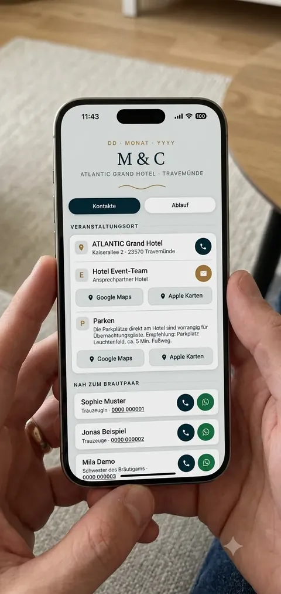

<div align="center">

# Wedding Contacts

**A tiny mobile-first web app so nobody has to ask "where do we park?" five minutes before the ceremony.**

[](https://developer.mozilla.org/en-US/docs/Web/HTML)
[](https://developer.mozilla.org/en-US/docs/Web/CSS)
[](https://developer.mozilla.org/en-US/docs/Web/JavaScript)
[](https://web.dev/progressive-web-apps/)
[](#)
[](https://wedding-contacts-mobile.vercel.app/)

[**Live demo →**](https://wedding-contacts-mobile.vercel.app/)

<br />



</div>

---

## The story

In the middle of all the wedding planning chaos, the same questions kept popping up in the family chat:

> "We need a phone list."
> "What's happening when?"
> "Where's the wedding again?"
> "Where do we park?"
> "Who's the contact person for the hotel?"

So I built this one weekend. Dropped the link in the chat. All five questions got solved, permanently, in one message.

That was the whole point. No login, no app to install, no waiting for a 800 KB framework bundle. Open the link, the answer is already on the screen. Tap once and you're calling the right person or looking at the parking lot in Maps.

## What it does

Everything a guest needs on the wedding day, on one page, on their phone.

- One-tap **call**, **WhatsApp**, or **email** for every contact
- **Tap-to-copy** phone numbers (with a clipboard fallback that actually works)
- **Venue and parking** with direct links to Google Maps and Apple Maps
- A separate **schedule page** with the day-of timeline
- **WhatsApp share** button so guests can forward the schedule in two taps
- Installable as a **PWA**, works offline, stays fast on bad venue Wi-Fi

## Why it's fast

Because it does almost nothing.

| Choice | Why it matters |
|---|---|
| No framework runtime | Zero JS parse cost from libraries |
| No external dependencies | No third-party requests, no CDN roundtrips |
| Inline critical CSS | First paint doesn't wait for a stylesheet |
| One tiny inline `<script>` | JS only for the interactions that need it |
| App-shell precache | Second visit renders from cache instantly |
| Cache-first for static assets | Icons and styles come from disk on repeat views |
| Network-first for HTML | Fresh content when online, cached fallback when not |

The result: it feels instant, and it doesn't fall apart when 200 people share the same overloaded hotel Wi-Fi.

## Tech

Plain HTML, CSS, and Vanilla JavaScript. A Service Worker with the Cache API. A Web App Manifest. Deployed as static files on Vercel.

No framework. No bundler. No build step. `git push` is the pipeline.

## Project structure

```
.
├── index.html            # Contacts, venue, parking
├── ablauf.html           # Day-of schedule
├── sw.js                 # Service Worker
├── manifest.webmanifest  # PWA manifest
├── icon.svg              # App icon
└── docs/
    └── preview.webp      # README screenshot
```

## Run it locally

```bash
python3 -m http.server 8080
# or
npx serve .
```

Open `http://localhost:8080`. The Service Worker only registers on HTTPS or `localhost`, so local dev works out of the box.

## Deployment

Push to `main`. Vercel serves the raw files. That's it.

## Privacy

All personal contact names, phone numbers, WhatsApp links, and email addresses in the public version are mock data. The venue and parking info stay real so the Maps integration is a live, working demo.

## What's next

I'm thinking about turning this into a small no-code tool — couples fill in their details, get their own version, no code involved. If that sounds useful to you, ping me.

## License

MIT. Use it as a template for your own wedding, workshop, event, or meetup.
